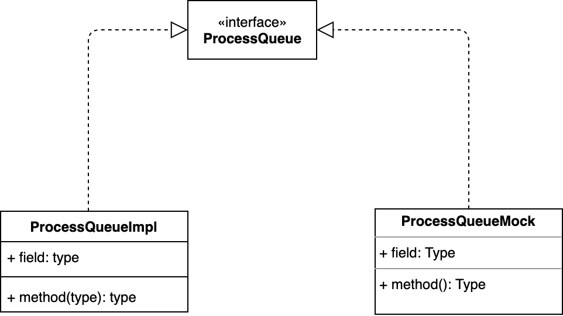
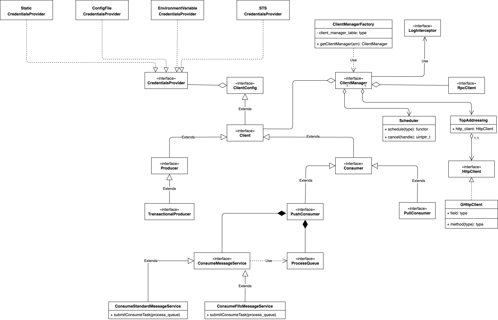

[](https://github.com/lizhanhui/rocketmq-client-cpp/actions/workflows/main.yml)
### Introduction
Apache RocketMQ supports two styles of APIs to acknowledge messages once they are successfully processed.

1. Selective Acknowledgement
   For each logical message queue(aka, topic partition), SDK manages offsets locally and periodically syncs committed offset to brokers in charge.
2. Per Message Acknowledgement
   On consumption of each message, SDK acknowledge it to the broker instantly. Broker is responsible of managing consuming progress. 

Either of them is widely adopted by products. Per message acknowledgement simplifies SDK implementation while selective approach is more performant considering that fewer RPCs are required.

### Transport Layer

This SDK is built on top of [gRPC](https://grpc.io/). [Protocol Buffers](https://developers.google.com/protocol-buffers) is used to serialize application messages.

### Type Hierarchy
Classes of this project are designed to be interface oriented.

This paradigm makes dependency injection possible. DI is especially helpful when writing unit tests.

### Core Concepts


### Code Style
Generally, we follow [Google C++ Code Style](https://google.github.io/styleguide/cppguide.html). A few exceptions are made to maintain API compatibility.
1. C++ exception is only allowed in the outer wrapper classes, for example, DefaultMQProducer, DefaultMQConsumer.
2. C++ --std=c++11 is preferred. We intend to maintain the same compiler compatibility matrix to [those of gRPC](https://github.com/grpc/grpc/blob/master/BUILDING.md)
3. Smart pointers are preferred where it makes sense. Use raw pointers only when it is really necessary.

### Dependency Management   
Considering SDK built on top of gRPC, ensure it is really necessary before introducing a third-party library. Check [gRPC deps](https://github.com/grpc/grpc/blob/master/bazel/grpc_deps.bzl) and [gRPC extra deps](https://github.com/grpc/grpc/blob/master/bazel/grpc_extra_deps.bzl) first!

When introducing a third-party dependency or raising version of a dependency, make sure it is back-off friendly. For example,
```
if "com_google_googletest" not in native.existing_rules():
   http_archive(
         name = "com_google_googletest",
         sha256 = "b4870bf121ff7795ba20d20bcdd8627b8e088f2d1dab299a031c1034eddc93d5",
         strip_prefix = "googletest-release-1.11.0",
         urls = [
            "https://github.com/google/googletest/archive/refs/tags/release-1.11.0.tar.gz",
         ],
   )
```

### How To Build

#### Build with Bazel

[Google Bazel](https://bazel.build/) is the primary build tool we supported, Please follow [bazel installation guide](https://docs.bazel.build/versions/main/install.html).

1. Build
   From the repository root, 
   ```
   bazel build //...
   ```
2. Run Unit Tests
   From the repository root,
   ```
   bazel test //src/test/cpp/ut/...
   ```

#### Build with CMake

   1. Make sure you have installed a modern CMake 3.13+ and C++ compilation toolchain that at least supports C++11;

   2. Following [gRPC installation instructions](https://grpc.io/docs/languages/cpp/quickstart/) to install grpc. 
      gRPC [v1.48.0](https://shutian.oss-cn-hangzhou.aliyuncs.com/cdn/grpc/grpc_v1.48.0.tar.gz) with its third-party dependencies may be downloaded.

      Note: 
         * Remember to `export MY_INSTALL_DIR=$HOME/grpc` as our primary CMakeLists.txt hints 

            ```cmake
            list(APPEND CMAKE_PREFIX_PATH $ENV{HOME}/grpc)
            ```
            If your grpc is installed somewhere else yet non-standard, please adjust accordingly.

         * When configure grpc, use your pre-installed system package if possible; 
            ```shell
            cmake -DCMAKE_INSTALL_PREFIX=$HOME/grpc -DgRPC_SSL_PROVIDER=package -DgRPC_ZLIB_PROVIDER=package
            ```
            A few more options are involved. Check CMakeLists.txt of grpc
            ```cmake
            # Providers for third-party dependencies (gRPC_*_PROVIDER properties):
            # "module": build the dependency using sources from git submodule (under third_party)
            # "package": use cmake's find_package functionality to locate a pre-installed dependency

            set(gRPC_ZLIB_PROVIDER "module" CACHE STRING "Provider of zlib library")
            set_property(CACHE gRPC_ZLIB_PROVIDER PROPERTY STRINGS "module" "package")

            set(gRPC_CARES_PROVIDER "module" CACHE STRING "Provider of c-ares library")
            set_property(CACHE gRPC_CARES_PROVIDER PROPERTY STRINGS "module" "package")

            set(gRPC_RE2_PROVIDER "module" CACHE STRING "Provider of re2 library")
            set_property(CACHE gRPC_RE2_PROVIDER PROPERTY STRINGS "module" "package")

            set(gRPC_SSL_PROVIDER "module" CACHE STRING "Provider of ssl library")
            set_property(CACHE gRPC_SSL_PROVIDER PROPERTY STRINGS "module" "package")

            set(gRPC_PROTOBUF_PROVIDER "module" CACHE STRING "Provider of protobuf library")
            set_property(CACHE gRPC_PROTOBUF_PROVIDER PROPERTY STRINGS "module" "package")

            set(gRPC_PROTOBUF_PACKAGE_TYPE "" CACHE STRING "Algorithm for searching protobuf package")
            set_property(CACHE gRPC_PROTOBUF_PACKAGE_TYPE PROPERTY STRINGS "CONFIG" "MODULE")

            if(gRPC_BUILD_TESTS)
            set(gRPC_BENCHMARK_PROVIDER "module" CACHE STRING "Provider of benchmark library")
            set_property(CACHE gRPC_BENCHMARK_PROVIDER PROPERTY STRINGS "module" "package")
            else()
            set(gRPC_BENCHMARK_PROVIDER "none")
            endif()

            set(gRPC_ABSL_PROVIDER "module" CACHE STRING "Provider of absl library")
            set_property(CACHE gRPC_ABSL_PROVIDER PROPERTY STRINGS "module" "package")
            ```
      
   3. OpenSSL development package is also required. 

   4. Run the following commands to build from ${YOUR_GIT_REPOSITORY}/cpp directory
      ```shell
      mkdir build && cd build
      cmake -DOPENSSL_ROOT_DIR=/usr/local/Cellar/openssl@1.1/1.1.1q ..
      make -j $(nproc)
      ```
   5. Static archive and dynamic linked libraries are found in the build directory.

### IDE
[Visual Studio Code](https://code.visualstudio.com/) + [Clangd](https://clangd.llvm.org/) is the recommended development toolset. 
1. VSCode + Clangd
   
   [Clangd](https://clangd.llvm.org/) is a really nice code completion tool. Clangd requires compile_commands.json to work properly. 
   To generate the file, we need clone another repository along with the current one.

   ```
   git clone git@github.com:grailbio/bazel-compilation-database.git
   ```
   From current repository root,

   ```
   ../bazel-compilation-database/generate.sh
   ```
   Once the script completes, you should have compile_commands.json file in the repository root directory.

   LLVM project has an extension for [clangd](https://marketplace.visualstudio.com/items?itemName=llvm-vs-code-extensions.vscode-clangd). Please install it from the extension market. 

   The following configuration entries should be appended to your VSC settings file.
   ```text
      "C_Cpp.intelliSenseEngine": "Disabled",
      "C_Cpp.autocomplete": "Disabled", // So you don't get autocomplete from both extensions.
      "C_Cpp.errorSquiggles": "Disabled", // So you don't get error squiggles from both extensions (clangd's seem to be more reliable anyway).
      "clangd.path": "/Users/lizhanhui/usr/clangd_12.0.0/bin/clangd",
      "clangd.arguments": ["-log=verbose", "-pretty", "--background-index"],
      "clangd.onConfigChanged": "restart",
   ```

2. CLion + Bazel Plugin
   
   Bazel also has a plugin for CLion.
